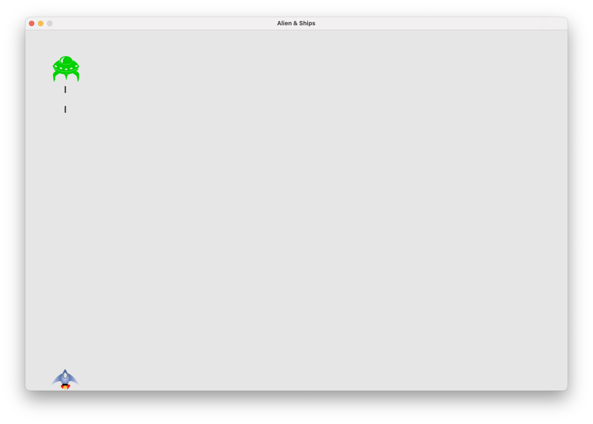

<div align="center">
    
    <h1>✨ Learning a programing language ✨</h1>
</div>


<h4 align="center">
    A repository in which I will be practicing new programming languages.
    
</h4>

<p align="center">
  <a href="https://www.linkedin.com/in/edgar-figueroa-gtz/">
    
  </a>
</p>

<p align="center">
  <a href="#programing-languages">Languages</a> •
  <a href="#samples">Samples</a>
</p>

# Programing Languages

- [Python](#python)
  * [Github api](#github-api)
  * [Aliens](#aliens)
  


## Samples

#### Python

<details id="github-api">
  <summary>Github API</summary>

  ## Getting Started
  A basic request sample to the github api that request to total of repositories for specific language (you can choose the lenguage).

```
.
├── Python          
│   ├── github-api
│   └── ...
└── ...
```
### Prerequisites

To run the game need to install pygame.
* pip
  ```bash
    $ python -m pip install --user requests
    $ python -m pip install --user plotly
  ```
* In project path
  ```bash
    $ python python_repos.py
  ```
* Run test
  ```bash
    python3 -m unittest discover
  ```

</details>

<details id="aliens">
  <summary>Aliens</summary>
  

## Getting Started

This is an example of a minigame.

```
.
├── Python          
│   ├── Aliens-Ship
│   └── ...
└── ...
```
### Prerequisites

To run the game need to install pygame.
* pip
  ```bash
    $ python -m pip install --user pygame
  ```
* In project path
  ```bash
    $ python alien_battle.py
  ```

</details>


